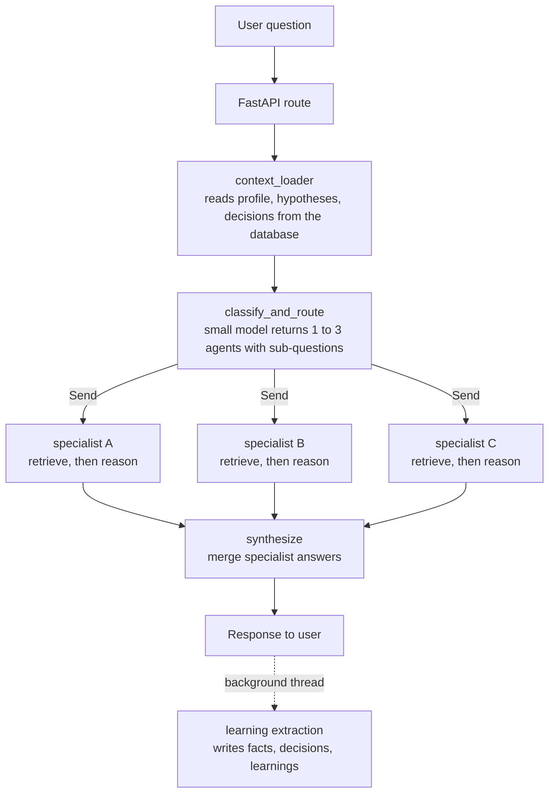

# AI Cofounder

A multi-agent advisor for early stage founders. You ask a startup question, a router classifies it and sends it to one to three specialist agents (go-to-market, finance, product, legal and others), each specialist retrieves from its own knowledge index and writes an answer, and a synthesizer merges those answers into one reply. It is built with FastAPI, LangGraph, FAISS, local sentence-transformers embeddings, SQLAlchemy, and Anthropic Claude.

Size: 4,279 lines of Python code in `src/` and `scripts/`, not counting blank lines, comments, and docstrings. The count includes lines inside multi-line prompt strings. The test suite has 307 test cases from 194 test functions.

**Origin:** I built this as an internal tool while co-founding a startup, to get structured startup advice grounded in a knowledge base. This public version ships with a fictional sample company and a small sample knowledge pack.

## System design

### Request pipeline



1. **Context loader** (`src/agent/nodes/context_loader.py`). Reads the user profile, active hypotheses, the active problem statement, the ten most recent decisions and timeline events, and the latest metrics row. It appends the problem statement, up to five hypotheses, and up to five decisions to the static company description in `src/agent/prompts/company_context.py`. The result is one `company_context` string that every later prompt receives. Timeline events and metrics are loaded into the state, and no prompt uses them yet.
2. **Classify and route** (`src/agent/nodes/classifier.py`). One call to the smaller model asks for a JSON list of agents, each with a rewritten sub-question, a relevance label, and optional methodology hints. The reply is parsed by hand. The node keeps at most three entries, skips entries that are not objects or that name an unknown agent, and falls back to the general `cofounder` agent if the model call fails, the JSON cannot be parsed, the JSON is not a list, or no valid agent is left. It is wired as a conditional edge and returns LangGraph `Send` objects, so the chosen specialists run in parallel.
3. **Specialists** (`src/agent/nodes/specialist.py`). `make_agent_node(agent_id)` builds one node per entry in `AGENT_REGISTRY` (11 entries). Each node retrieves context, fills the specialist prompt, calls the larger model, and returns a single `AgentOutput`. The state field `agent_outputs` uses an `operator.add` reducer, so parallel nodes append without overwriting each other.
4. **Synthesis** (`src/agent/nodes/synthesizer.py`). One call to the larger model merges the specialist answers. If that call fails, the node returns the raw specialist answers concatenated.
5. **Learning extraction** (`src/agent/nodes/learning_extractor.py`). This is not a graph node. The API route starts it in a daemon thread after the response has been saved. It asks the smaller model to extract business facts, decisions, hypothesis updates, profile updates, and domain learnings, then writes them to the database and to the FAISS index that the named agent reads. Agent ids that are not in the registry are skipped. Messages shorter than 50 characters are skipped.

`src/agent/graph.py` compiles two graphs from the same base. `graph` runs the full pipeline for the synchronous endpoint. `graph_pre_synthesis` stops after the specialists, and the streaming endpoint runs synthesis itself.

Adding an agent means adding one entry to `AGENT_REGISTRY` in `src/agent/agents/registry.py` and putting documents in `data/knowledge/agents/{agent_id}/`. The graph builder, the classifier prompt, and the node factory all read from the registry. The fintech and healthcare agents are examples of vertical experts. Replace them with the verticals that matter to your company.

### Retrieval design

- **Embeddings** are computed locally with `BAAI/bge-small-en-v1.5` (384 dimensions, L2 normalized). No embedding API is called.
- **Vector store** (`src/rag/vector_store.py`). Each store is a FAISS `IndexFlatIP` plus a JSON sidecar file that holds the chunk text and metadata. With normalized vectors, inner product equals cosine similarity.
- **Chunking** (`src/rag/document_processor.py`). Documents are split into chunks of about 1,000 characters with 200 characters of overlap. Chunk ends are moved to the nearest sentence boundary within 100 characters. PDF, EPUB, HTML, TXT, and Markdown are supported.
- **Per-agent indexes.** There is one shared index, `unified_knowledge`, and one index per specialist, named `{agent_id}_knowledge`. The general and devil's advocate agents read the shared index. The ingest script for agents also copies selected chunks from the shared index into agent indexes, based on keywords in the source name.
- **Methodology-aware routing** (`src/agent/knowledge_router.py`). A registry maps 19 named methodologies to keywords, to the source files that describe them, and to a short instruction on how to apply them. `route_query` looks for each keyword as whole words in the sub-question and the original question, so "eos" does not match "videos", and picks the methodology with the most hits. If there are no hits, the first methodology hint from the classifier is used.
- **Filtering happens after the search.** When a methodology matches, the specialist runs a similarity search over the shared index that fetches 24 candidates, keeps up to 8 of type `book`, and then drops every result that does not come from the methodology's source. The methodology instruction is added to the prompt whether or not any passage survives.
- **Fallback.** If the filtered search returns nothing, the specialist searches its own full index. If that index is empty, the prompt says that no knowledge base is available.

### Memory model

All state is in one SQL database (SQLite by default) defined in `src/memory/database.py`, 16 tables in total.

| Group | Tables | Written by |
|---|---|---|
| User | `users`, `conversations` | seed script, profile API, learning extraction |
| Shared company | `timeline`, `decisions`, `hypotheses`, `problem_statements`, `metrics`, `customer_calls` | REST API, call transcript analysis, learning extraction |
| Chat audit | `chat_messages`, `agent_consultations` | chat endpoints |
| Collaboration | `disagreements`, `collaboration_patterns`, `knowledge_transfers`, `reflections`, `tasks` | nothing yet, schema only |
| Link table | `timeline_decision_link` (timeline events to decisions) | nothing yet, schema only |

Decisions store a rationale per user, and most rows record which user created them. A second kind of memory is the FAISS index: learning extraction appends short domain learnings to it, tagged `source_type="business_learning"`, so an agent can retrieve them later.

### Streaming API

`POST /api/chat/stream` returns Server-Sent Events in two phases.

1. It iterates over `graph_pre_synthesis.stream(..., stream_mode="values")`, which yields one state snapshot per superstep. Status events are sent per snapshot. The first snapshot is the initial state, before context has loaded, and produces "Loading company context...". The snapshot with context loaded produces "Routing to specialist agents...". The snapshot with specialist answers produces one "Received input from ..." event per specialist. Specialists that run in parallel finish in the same superstep, so those events arrive together, after the slowest one.
2. It builds the synthesis prompt and calls the Anthropic streaming API, sending one `token` event per text chunk.

A final `done` event carries the session id, the agents consulted, the sources, and each specialist's full answer. An `error` event is sent if the pipeline fails. The chat turn is saved to the database before `done` is sent.

### Design notes and tradeoffs

Each note says what the code does and what that costs.

- **Two model sizes.** Classification, learning extraction, and call transcript analysis call the model named in `HAIKU_MODEL`. Specialists, synthesis, and interview question generation call the model named in `SONNET_MODEL`. The cost is two model settings to keep current, and routing that depends on the smaller model. If it picks the wrong agents, nothing later in the pipeline corrects that. The JSON it returns is requested in the prompt and parsed by hand. It is not tool use and there is no schema validation beyond the shape checks in the classifier.
- **Methodology filtering after the search.** The filter is a post-filter on a top 24 search, as described above. The cost is a keyword list maintained by hand, and a filter that can return nothing even when the source is indexed, because its passages may not rank in the first 24. Single common words in the keyword list, such as "rocks" or "scorecard", still select a methodology when they appear as words. The effect of methodology filtering on answer quality has not been measured.
- **Learning extraction in a background thread.** The response is returned before extraction starts. The cost is that a failed extraction is visible only in the logs, that a learning from one question may not be stored before the next question arrives, and that the index files are rewritten without a lock, so two extractions that finish together can overwrite each other's additions.
- **Parallel specialists with a reducer.** Specialists are dispatched with `Send` and run in the same superstep. The wait is set by the slowest specialist. The cost is one larger-model call per specialist chosen.
- **One node factory.** All specialist nodes are built by the same function from registry data. The cost is that specialists differ only in name, description, and index.
- **Local embeddings and a flat index.** Search is exact, over an `IndexFlatIP`. The cost is that a specialist loads its index and sidecar file from disk on every request, and that every addition rewrites both files in full.
- **Two graphs.** `synthesize` calls the Anthropic SDK directly, so the streaming endpoint runs the graph up to the specialists and performs synthesis outside the graph, where it can forward tokens. The cost is that the synthesis call exists in two places. Streaming from inside the graph, with a LangChain chat model and `stream_mode="messages"` or with a stream writer and `stream_mode="custom"`, would remove the duplication.

### Known limitations

**Security.** This is a local development tool and must not be deployed as is. The bearer token is the user id, and the streaming route reads it without the shared auth dependency. CORS allows every origin. Model output is written to memory without review. Call transcripts are stored as plain text and sent to the model as they are. Exception text is returned to the client.

- **Retrieval filters after the search.** See the design note above. No books ship with this repository, so with the sample pack alone every methodology match falls back to the agent's own index.
- **Fixed confidence.** Every specialist reports a confidence of "medium". The value is set in code, shown in the UI, and passed to the synthesis prompt. The `llm_tier` and `tools` fields in the registry are not read by any code.
- **Shared prompt template.** Every specialist uses `SPECIALIST_PROMPT` with only the agent name and a description of a few sentences swapped in. The agents differ in what they retrieve more than in how they reason.
- **Memory pollution.** Extracted facts, decisions, and hypotheses are written without review or deduplication. The text given to the extractor includes the model's own answers, so advice can be stored as if it were a company decision, and the context loader then feeds recent decisions and hypotheses into later prompts.
- **No conversation history.** Each request sends only the current message into the graph. Sessions are stored and can be listed, but earlier turns are not given to the models, and the graph has no checkpointer. Conversation rows are saved with an embedding that no code reads yet.
- **Latency and cost.** Each question makes four to six model calls: one classification, one to three specialists, one synthesis, and one background extraction. The first streamed token cannot arrive until every specialist has finished. The README of the private version recorded about 24 seconds to first token and about 50 seconds in total. I have not measured this again for the public version, and the repository has no benchmark script.
- **No evaluation of answer quality.** The tests mock every model call. They check routing, state handling, persistence, and the API, not whether the advice is good.

## What it looks like

The output below was captured from a fresh copy of this repository. Log lines from the embedding library are removed and the search response is shortened where marked. Chat needs an API key and was not run for this README, so no model answer is shown.

Setup and ingest of the sample knowledge pack:

```text
$ python scripts/setup/init_database.py
Initializing database...
Database initialized successfully.
$ python scripts/setup/create_users.py
Created user: founder (Founder)
Created user: cofounder (Co-founder)
Done.
$ python scripts/ingest/ingest_sample.py
2026-09-29 03:00:58,020 - Embedding 8 chunks from sample notes...
2026-09-29 03:01:05,355 - Added 8 chunks. Store size: 8
$ python scripts/ingest/ingest_agent_knowledge.py --agent all
2026-09-29 03:01:06,077 - Ingesting knowledge for: gtm
2026-09-29 03:01:06,078 -   Processed choosing_a_first_segment.md: 2 chunks
2026-09-29 03:01:06,080 -   Cross-ingesting 2 chunks from unified_knowledge
2026-09-29 03:01:13,361 -   Embedding 2 agent-specific chunks...
2026-09-29 03:01:13,411 -   Added 2 chunks. Store size: 4
2026-09-29 03:01:13,412 - Ingesting knowledge for: finance
2026-09-29 03:01:13,414 -   Processed unit_economics_basics.md: 3 chunks
2026-09-29 03:01:13,415 -   Cross-ingesting 2 chunks from unified_knowledge
2026-09-29 03:01:13,463 -   Embedding 3 agent-specific chunks...
2026-09-29 03:01:13,523 -   Added 3 chunks. Store size: 5
2026-09-29 03:01:13,523 - Ingesting knowledge for: marketing
2026-09-29 03:01:13,525 -   Store size: 0
[six more agents, five of them with store size 0]
2026-09-29 03:01:13,579 - Done. Total new chunks added: 5
```

A search against the running server, `GET /api/knowledge/search?q=How many months of runway do we have?&top_k=2` with the header `Authorization: Bearer founder`:

```text
{
  "query": "How many months of runway do we have?",
  "results": [
    {
      "content": "# Runway math\n\nSample note written for this repository. Original text, generic advice.\n\nRunway is the number of months a company can operate before it runs out [shortened]",
      "source_type": "sample_note",
      "source_name": "runway_math",
      "score": 0.753240704536438,
      "chunk_index": 0,
      "title": "Runway math",
      [seven fields with null values removed]
    },
    {
      "content": "ue, with no growth assumed.\n- Planned case: the hires and spending you intend to make, with revenue you have already signed.\n- Bad case: planned spending with r [shortened]",
      "source_type": "sample_note",
      "source_name": "runway_math",
      "score": 0.6475562453269958,
      "chunk_index": 1,
      "title": "Runway math",
      [seven fields with null values removed]
    }
  ],
  "formatted": "[Source 1: sample_note: \"Runway math\"]\n# Runway math\n\nSample note written for this repository. [shortened]"
}
```

The second result begins in the middle of a word. Chunk ends are moved to a sentence boundary, and chunk starts are not: each chunk starts 200 characters before the previous chunk's end.

## How this was built

I designed the system and directed the build, and I changed the design after using it. Learning extraction moved to a background thread because responses were slow. The code and the tests were written with Claude Code, Anthropic's coding agent.

## Quick start

Requires Python 3.10 or later. Tested with Python 3.11.

```bash
# Setup
python -m venv venv
source venv/bin/activate        # Windows Git Bash: source venv/Scripts/activate
pip install -r requirements.txt
cp .env.example .env            # then set ANTHROPIC_API_KEY

# Database and sample users (founder, cofounder)
python scripts/setup/init_database.py
python scripts/setup/create_users.py

# Ingest the sample knowledge pack
python scripts/ingest/ingest_sample.py
python scripts/ingest/ingest_agent_knowledge.py --agent all

# Run
uvicorn src.api.main:app --reload
# Open http://localhost:8000
```

Notes:

- The first ingest or test run downloads the embedding model, about 130 MB.
- On Windows, installing `torch` can fail with a path length error if the virtual environment sits in a deeply nested folder and long path support is off. A shorter folder path avoids it.
- The knowledge search endpoint and the UI work without an API key. Chat needs a valid `ANTHROPIC_API_KEY`.

### The sample knowledge pack

Six short original notes are included so that retrieval returns something on first install.

| Path | Goes into |
|---|---|
| `data/knowledge/sample/*.md` (customer interviews, pricing experiments, outbound basics, runway math) | `unified_knowledge`, by `ingest_sample.py` |
| `data/knowledge/agents/gtm/choosing_a_first_segment.md` | `gtm_knowledge`, by `ingest_agent_knowledge.py` |
| `data/knowledge/agents/finance/unit_economics_basics.md` | `finance_knowledge`, by `ingest_agent_knowledge.py` |

With only the sample pack, the general, devil's advocate, GTM, finance, and business development agents have something to retrieve. The other agents answer from the company context and the model's general knowledge.

### Using your own company and knowledge

1. Edit `src/agent/prompts/company_context.py`. It holds the company name, a one-line description, and the longer company context. The four prompt templates take the name and description from there. Tidewater Labs is a fictional company used as sample data.
2. Rewrite the few-shot examples in `src/agent/prompts/classifier.py`. They are questions written for the sample company.
3. Add your own material, which you have the right to use, to the matching folder under `data/knowledge/` and run the ingest script for that folder (table below). Apart from the sample pack, no knowledge content ships with this repository, and `.gitignore` keeps anything you add to these folders out of version control.
4. No books ship with this repository. To use methodology filtering, add books you own to `data/knowledge/books/` as PDF, EPUB, TXT, or Markdown, and name each file to match the router's `source_names` value for that methodology in `src/agent/knowledge_router.py`. The form is `Title_-_Author`, for example `The_Mom_Test_-_Rob_Fitzpatrick.epub`. Then run `python scripts/ingest/ingest_books.py`. You can also edit `source_names` to match your own file names.

| Folder | Ingest script | Index | Ignored by git |
|---|---|---|---|
| `data/knowledge/books/` | `scripts/ingest/ingest_books.py` | `unified_knowledge` | yes |
| `data/knowledge/research_papers/` | `scripts/ingest/ingest_research_papers.py` | `unified_knowledge` | yes |
| `data/knowledge/paul_graham/` (essays) | `scripts/ingest/ingest_pg_essays.py` | `unified_knowledge` | yes |
| `data/knowledge/yc_content/` (lecture transcripts) | `scripts/ingest/ingest_yc_content.py` | `unified_knowledge` | yes |
| `data/knowledge/call_transcripts/` | `scripts/ingest/ingest_call_transcript.py` | `unified_knowledge` | yes |
| `data/knowledge/agents/{agent_id}/` | `scripts/ingest/ingest_agent_knowledge.py --agent {agent_id}` | `{agent_id}_knowledge` | yes, except the two sample notes |
| `data/knowledge/sample/` | `scripts/ingest/ingest_sample.py` | `unified_knowledge` | no |

Of these scripts, I ran `ingest_sample.py` and `ingest_agent_knowledge.py` when preparing the public version. The other five are unchanged from the private version and were not run again, because their folders are empty here.

## Tech stack

| Layer | Technology |
|---|---|
| API | FastAPI, Server-Sent Events |
| Agent orchestration | LangGraph `StateGraph`, `Send` for parallel dispatch |
| Models | Anthropic Claude, called through the `anthropic` SDK |
| Embeddings | sentence-transformers, `BAAI/bge-small-en-v1.5`, run locally |
| Vector store | FAISS `IndexFlatIP` with JSON sidecar metadata |
| Database | SQLAlchemy, SQLite by default |
| Frontend | Plain HTML, CSS, and JavaScript, served by FastAPI |
| Tests | pytest |

Settings are defined in `src/config/settings.py` and read from environment variables or `.env`.

| Setting | Default | Used by |
|---|---|---|
| `ANTHROPIC_API_KEY` | placeholder | every model call |
| `HAIKU_MODEL` | `claude-haiku-4-5-20251001` | classification, learning extraction, call transcript analysis |
| `SONNET_MODEL` | `claude-sonnet-4-6` | specialists, synthesis, interview question generation |
| `DATABASE_URL` | `sqlite:///./data/consultant.db` | database engine |
| `EMBEDDING_MODEL` | `BAAI/bge-small-en-v1.5` | embeddings |
| `VECTOR_STORE_DIR` | `vector_stores` | specialists, learning extraction, the knowledge search endpoint, and the ingest scripts |
| `CHUNK_SIZE` | `1000` | defined, not read. The ingest scripts use the defaults in `DocumentProcessor`, which are the same values |
| `CHUNK_OVERLAP` | `200` | defined, not read, as above |
| `LOG_LEVEL` | `INFO` | defined, not read |

## API endpoints

All `/api` routes expect `Authorization: Bearer {user_id}`, for example `Bearer founder`.

| Method | Endpoint | Description |
|---|---|---|
| `POST` | `/api/chat/` | Send a message, get the synthesized response |
| `POST` | `/api/chat/stream` | Same pipeline over SSE, with synthesis streamed token by token |
| `GET` | `/api/chat/sessions/` | List chat sessions for the user |
| `GET` | `/api/chat/sessions/{session_id}` | Get the messages of one session |
| `GET` | `/api/knowledge/search` | Semantic search over `unified_knowledge` (`q`, `top_k`, `source_type`) |
| `POST` `GET` | `/api/calls/` | Create or list customer call records |
| `GET` `PUT` | `/api/calls/{call_id}` | Read or update a call, including its transcript |
| `POST` | `/api/calls/{call_id}/questions` | Generate interview questions for a call |
| `POST` | `/api/calls/{call_id}/analyze` | Analyze a transcript and create hypotheses |
| `POST` `GET` | `/api/company/timeline` | Create or list timeline events |
| `GET` `PUT` | `/api/company/timeline/{event_id}` | Read or update a timeline event |
| `POST` `GET` | `/api/company/decisions` | Create or list decisions |
| `PUT` | `/api/company/decisions/{decision_id}` | Update a decision |
| `POST` `GET` | `/api/company/hypotheses` | Create or list hypotheses |
| `PUT` | `/api/company/hypotheses/{hypothesis_id}` | Update a hypothesis |
| `POST` `GET` | `/api/company/metrics` | Record or list metrics |
| `POST` `GET` | `/api/validation/problem` | Create a problem statement or get the active one |
| `GET` | `/api/validation/problem/history` | List problem statement versions |
| `PUT` | `/api/validation/problem/{problem_id}` | Update a problem statement |
| `POST` | `/api/validation/hypotheses` | Create a hypothesis with validation criteria and optional evidence |
| `GET` | `/api/validation/hypotheses/{hypothesis_id}` | Get a hypothesis |
| `POST` | `/api/validation/hypotheses/{hypothesis_id}/evidence` | Add evidence to a hypothesis |
| `GET` | `/api/users/` | List users |
| `GET` `PUT` | `/api/users/{user_id}` | Read or update a user profile |
| `GET` | `/health` | Liveness check |

Interactive documentation is served at `/docs` when the server is running.

## Tests

```bash
pytest tests/
```

307 test cases from 194 test functions. The difference is parametrization, most of it in the router tests, where a few checks repeat over the 19 methodologies.

`tests/conftest.py` keeps the suite away from real resources. It points the database and the vector store folder at a temporary directory, replaces the API key with a dummy value, fails any test that reaches the real Anthropic client, and replaces background learning extraction with a recorder. No API key is needed.

| File | Test cases | Test functions | Covers |
|---|---|---|---|
| `tests/test_knowledge_router.py` | 104 | 22 | Whole-word keyword routing, hint resolution, source name format |
| `tests/test_rag.py` | 32 | 32 | Chunking, embeddings, vector store, retriever, search endpoint, configured store folder |
| `tests/test_api.py` | 26 | 26 | Users, timeline, decisions, hypotheses, problem statements |
| `tests/test_agent_graph.py` | 22 | 14 | Graph nodes, learning extraction, full graph execution |
| `tests/test_chat_api.py` | 22 | 22 | Chat endpoint, streaming endpoint, hand-off to background extraction, session history |
| `tests/test_integration_routing.py` | 20 | 20 | Routing through to prompt construction |
| `tests/test_classifier.py` | 18 | 11 | Classification, fallbacks, agent cap |
| `tests/test_database.py` | 17 | 17 | Models and memory managers |
| `tests/test_calls_api.py` | 13 | 13 | Customer call endpoints |
| `tests/test_customer_calls.py` | 12 | 12 | Customer call manager |
| `tests/test_registry_index_names.py` | 11 | 1 | Each agent reads the index that ingestion writes |
| `tests/test_prompts.py` | 10 | 4 | Prompt templates and the shared company name |

Not covered by any test: the UI, the ingest scripts other than the agent ingest, the two functions that generate interview questions and analyze call transcripts (their endpoints are tested with those functions replaced), and any call to a real model. `tests/test_rag.py` loads the real embedding model.

## Project structure

```
src/
  agent/
    graph.py               LangGraph pipeline, full and pre-synthesis
    knowledge_router.py    Methodology to source mapping
    state.py               TypedDict state schema
    agents/registry.py     Agent registry
    nodes/                 context_loader, classifier, specialist, synthesizer, learning_extractor
    prompts/               Prompt templates and the sample company context
  api/                     FastAPI app, routes, auth, schemas
  rag/                     Document processing, embeddings, vector store, retriever
  memory/                  SQLAlchemy models and manager classes
  intelligence/            Interview question generation, transcript analysis
  ui/                      Chat interface
scripts/
  setup/                   Database and sample user creation
  ingest/                  Ingest scripts, one per knowledge folder
data/knowledge/            Source documents, sample pack included
vector_stores/             FAISS indexes, generated
tests/
```
